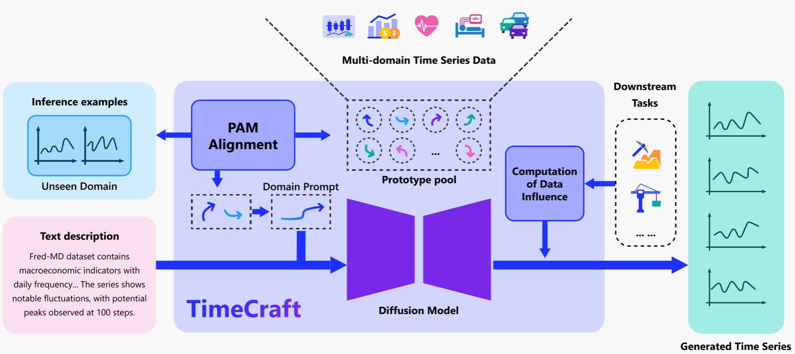
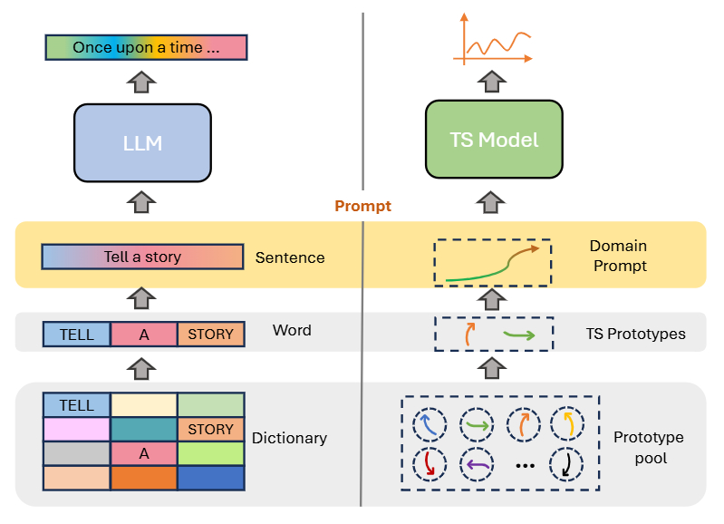
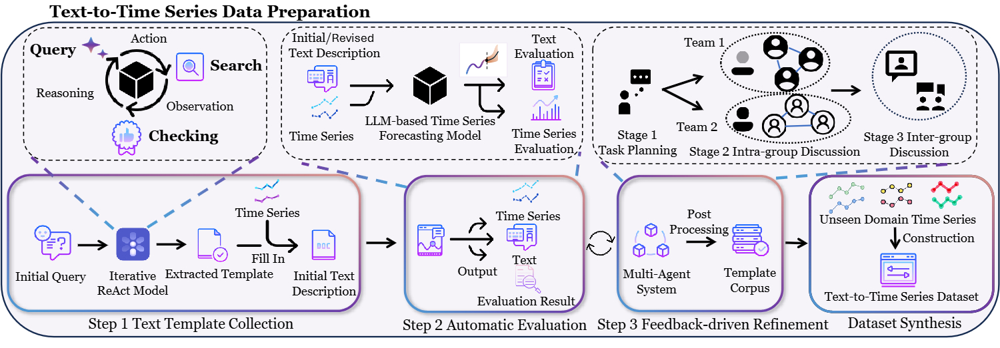

# Time Series Generation for Real-World Applications 
The rapid advancement of artificial intelligence has increasingly emphasized the critical role of time series data in powering intelligent decision-making across diverse domains, including healthcare, finance, energy, and transportation. In these fields, the ability to generate high-quality synthetic time series has become particularly valuable. **Time series generation** technology plays a vital role in alleviating **data scarcity**, especially in scenarios where collecting real-world data is expensive, time-consuming, or impractical. It also enables **privacy-preserving** analysis by producing realistic but non-identifiable synthetic data, reducing the risks associated with sharing sensitive information. Moreover, it supports **simulation and forecasting in risk-free environments**, allowing researchers and practitioners to safely explore hypothetical scenarios and train robust models. Together, these capabilities make time series generation an essential tool for a wide range of real-world applications.

Despite its potential, most existing methods are **limited to single-domain generation** and struggle to generalize across diverse real-world scenarios, where time series patterns vary significantly. In addition, traditional models often **lack controllability**—they generate data unconditionally, without the ability to guide specific trends, seasonality, or domain characteristics. Yet such control is crucial in practical applications, where tailored synthetic data is needed to support specific scenarios. Furthermore, many approaches focus solely on **replicating the training data distribution**, without considering whether the generated data is truly beneficial for downstream tasks

To address these limitations, we propose **TimeCraft**, a generic **diffusion model-based time series generation framework** designed for real world applications with the following characters:

1. ​**Cross-domain generalization**: 
TimeCraft introduces a ​​universal latent space​​ for time series by learning a shared set of *semantic prototypes* (analogous to a "dictionary" of temporal patterns). These prototypes encode domain-invariant features such as trends and seasonality, which are reusable across domains.
To adapt to new domains, TimeCraft employs a lightweight ​​Prototype Assignment Module (PAM)​​ that dynamically computes domain-specific weights for the prototypes using few-shot examples. This process constructs a *domain prompt*—a latent representation that captures the target domain’s unique characteristics without explicit labels or retraining.  Leveraging these prompts, TimeCraft generates high-fidelity time series that align with the structure of previously unseen domains.

2. **Text-based control​**​: Text carries rich semantic information, domain knowledge, and instance-specific cues that can guide time series generation in a more controllable and interpretable way. TimeCraft leverages a *multi-agent text generation system* to produce high-quality textual descriptions of time series patterns. These descriptions are used to construct paired time series–text data for training. Building on this, TimeCraft introduces a hybrid framework that combines semantic prototypes with free-form textual prompts, enabling flexible yet domain-grounded control over the generated time series.

3. **Target-aware adaptation**: TimeCraft introduces a novel approach where synthetic samples are generated with the explicit goal of improving downstream model performance—rather than simply mimicking the training data distribution. It incorporates an *influence-guided diffusion mechanism* that optimizes sample generation by quantifying the expected reduction in task-specific loss using *influence functions*. This ensures that the generated data is not only realistic, but also strategically tailored to enhance performance in practical applications such as forecasting, classification, and anomaly detection.

**TimeCraft** offers a unified, practical solution for real-world time series generation—combining cross-domain generalization, text-based control, and task-aware adaptation. It’s designed to produce high-quality, controllable synthetic data that’s both realistic and useful for downstream applications.


## Framework Overview



## 📚 Related Papers
#### Cross Domain Time Series Generation
- [TimeDP: Learning to Generate Multi-Domain Time Series with Domain Prompts, AAAI 2025](https://arxiv.org/pdf/2501.05403)

#### Controllability
- [BRIDGE: Bootstrapping Text to Control Time-Series Generation via Multi-Agent Iterative Optimization and Diffusion Modelling, ICML 2025](https://arxiv.org/pdf/2503.02445)

#### Adaptability
- [TarDiff: Target-Oriented Diffusion Guidance  for Synthetic Electronic Health Record  Time Series Generation, KDD 2025](https://arxiv.org/pdf/2504.17613)

#### General Time Series Techniques
- [MG-TSD: Multi-granularity Time Series Diffusion Models with Guided Learning Process, ICLR 2024](https://arxiv.org/pdf/2403.05751)
- [TimeRAF: Retrieval-Augmented Foundation model for Zero-shot Time Series Forecasting](https://arxiv.org/pdf/2412.20810)
-	[InvDiff: Invariant Guidance for Bias Mitigation in Diffusion Models, KDD 2025](https://arxiv.org/pdf/2412.08480)

#### Finance Application

- [Controllable Financial Market Generation with Diffusion Guided Meta Agent](https://arxiv.org/pdf/2408.12991)
- [MarS: a Financial Market Simulation Engine Powered by Generative Foundation Model, ICLR 2025](https://arxiv.org/pdf/2409.07486)


## 🔑 Key Features  

* **Multi-Domain Time Series Generation**: Robust cross-domain generalization enabled by **few-shot learning**, requiring minimal data from new domains.
* **Controllable Generation**: Natural language **text-based control** allows users to specify desired characteristics like trends or seasonality.
* **Target-Aware Generation**: Synthesized data is explicitly optimized to improve downstream model performance on tasks like forecasting or classification.
* **Diffusion-Based Framework**: Ensures high-fidelity, stable, and diverse time series through powerful diffusion modeling.
* **Automated Time Series Description**: Generates descriptive text to enhance interpretability and support paired training or analysis.
* **State-of-the-Art Results**: Achieves superior performance across both in-domain and unseen-domain benchmarks for both fedility and controllability.


## Time Series Prototypes: The Key to Cross-Domain Generation  

At the core of **TimeCraft** lies the concept of **Time Series Prototypes**—a foundational mechanism that enables effective cross-domain generalization. Much like how words serve as the fundamental building blocks for large language models, **time series prototypes** act as the smallest units that define time series styles. These prototypes encapsulate essential patterns such as **trends, seasonal variations, and periodic fluctuations**, allowing the model to understand and generate diverse time series data across multiple domains.  

Each prototype represents a fundamental time series component, and by **learning, combining, and reassembling these units**, **TimeCraft** achieves strong **cross-domain adaptability**. This innovative approach enables the model to generate realistic and domain-consistent time series, even in fields with limited available data.  



### Few-shot Prompting for Time Series Generation 

Real-world applications often require **personalized time series generation**, tailored to specific **domains, styles, or constraints**. However, due to the inherent complexity of time series data, manually describing the desired **trends, periodicity, and stochastic variations** can be highly challenging—especially for **unseen domains**.  

To address this, we introduce an **example-driven generation mechanism**, where users can simply provide **a few sample time series from the target domain** instead of manually specifying the style.  

**How It Works:**  
- The **Prototype Assignment Module (PAM)** extracts key characteristics from the provided samples, automatically constructing **domain prompts** that serve as conditional inputs for the generation process.  
- These **domain prompts** enable **TimeCraft** to generate time series that accurately reflect the statistical and temporal properties of the target domain.  
- By leveraging learned **time series prototypes**, the model generalizes well to **new, unseen domains** while maintaining high fidelity and controllability.  

This approach eliminates the need for explicit domain labels or textual descriptions, making **TimeCraft** a **highly flexible and adaptive** time series generation framework suited for a wide range of real-world applications.  

## Multi-Agent System and Hybrid Conditioning for Text based Control
### Time Series to Text Data Preparation Through Multi-Agent Systems

Generating time series from text can be a highly useful technique as text provides clear and intuitive descriptions of desired trends, statistical properties, and domain-specific nuances. 
However, real-world applications often face the dilemma of limited domain-specific text data to guide generation. This lack of data restricts the ability to specify desired trends and statistical features for time series generation accurately.

The critical challenge of **text-controlled time series generation** begins with creating **high-quality text-TS pairings** - a task complicated by the scarcity of domain-specific descriptive data. Our solution introduces a **three-stage multi-agent framework** that revolutionizes text template creation:  

1. **Text Template Collection**: We collect diverse sources of time series-related texts, such as articles, reports, and news, to construct a set of general-purpose text templates. These templates are domain-agnostic and can be adapted to different datasets and domains.  
2. **Automated Evaluation**: The generated text descriptions are evaluated to assess the quality of the descriptions in supporting downstream tasks.  
3. **Feedback-Driven Refinement**: Based on the evaluation results, the text descriptions are refined iteratively by the system, improving their accuracy and alignment with target domain characteristics.

Through this iterative process, the system generates **domain-agnostic templates** that can later be customized for specific domains and time series characteristics, ensuring high-quality text-to-time series pairings for controlled generation tasks. Statistical features are programmatically injected into templates, creating text descriptions that preserve essential temporal semantics, enabling the creation of text prompts that precisely capture **latent temporal patterns**, **domain-specific constraints**, and **instance-level characteristics** through natural language.  



### Text to Time Series Control: Bridging Modalities Through Hybrid Conditioning  

The discrete nature of textual data poses a significant challenge when trying to control the continuous structure of time series data. 
We address the challenge of **text-controlled time series generation** by integrating **textual descriptions** with **semantic prototypes** in a **hybrid prompt**. This enhances the model’s ability to generalize across domains. Diffusion models are used for their proven capability in generating high-quality time series. The **hybrid prompt** is fed into the **cross-attention layers** of the diffusion model, improving control over the generation process. 

## Target-Aware Generation with Influence Function Guidance

TimeCraft includes a lightweight guidance mechanism that enables *task-aware* synthetic time series generation.
Rather than relying solely on stylistic or domain-level prompts, this mechanism integrates feedback from downstream models to actively steer the diffusion process toward generating data that is directly beneficial for the target application.

### Core Components  

| Component | Role |
|-----------|------|
| **Guidance Set** | A small collection of time-series whose distribution mirrors the target task. For a quick start you can reuse the training set; advanced users may curate or weight the set with influence scores. |
| **Downstream Model** | Any differentiable network trained on the task of interest (e.g., RNN, Transformer). During generation its loss gradients provide step-by-step direction. |
| **Guidance Module** | Injects the downstream gradients into each denoising step, gently steering the diffusion trajectory without altering the backbone generator. |

Together, these core components form a seamless feedback loop where the **guidance set** defines the downstream data distribution, the **downstream model** encodes the specific task requirements, and the **guidance module** translates these signals into actionable gradients. As a result, TimeCraft efficiently guides the diffusion process to produce synthetic data tailored precisely to your downstream objectives.


## 🚀Quick Start
### 1. Environment setups 
Clone this repository and setup enviroment.
```bash
conda env create -f environment.yaml
```

### 2. Preparation for text controlled generation  
#### 2.1 Get text templates 

We provide example text templates and you can use them directly to build your dataset [here](Bridge/process/text_templates_example.json).
These templates are designed to describe time series data in a structured and diverse manner, covering various domains and statistical characteristics.

You can also collect and refine your own text templates using our multi-agent framework. 

#### 2.2 Apply text templates to generate textual descriptions for time-series data

We apply text templates to generate textual descriptions of time-series data by extracting statistical features (e.g., mean, standard deviation, trend) from each time window. These features are then filled into predefined templates to create descriptive narratives. Optionally, the descriptions are optimized using a large language model (LLM) for clarity and quality.

The implementation is available here:  [Code Link](process/ts_to_text.py).

The results are saved in CSV files with the suffix `_with_descriptions.csv`. 

Dataset split details can be found here: [Dataset Split](supplementary/dataset_split.md).

### 3. Preparation for target-aware generation  

#### 3.1 Prepare the Guidance Set  

TarDiff requires a **guidance set** whose distribution closely approximates that of the downstream task targets. This distributional alignment allows the model to steer the diffusion process toward generating data that is more relevant and useful for downstream applications.  

In our demo setting, we simply use the **training set** as a proxy for the guidance set. Users can later replace it with a more customized subset based on attribution methods (e.g., influence scores, gradient similarity) if desired.

#### 3.2 Prepare the Downstream Model for Guidance  

TarDiff requires a downstream model to compute gradients that guide the diffusion process toward generating task-relevant data.  
To achieve optimal utility, users are encouraged to use their **own downstream models** that best reflect the real application scenario (e.g., mortality prediction, sepsis detection).

The downstream model can be any differentiable architecture (e.g., RNN, Transformer, CNN) and should be trained on the same task as the generation target.  
During inference, TarDiff uses the gradients of the downstream loss with respect to generated samples to guide each denoising step.

**Optional: Use a simple RNN model as downstream guidance**  
We provide an example RNN classifier for classification-based tasks. It takes input time series of shape `(batch_size, time_steps, features)`.

### 4. Training the TimeCraft Framework

Use `main.py` for model training and `visualize.py` for domain prompt visualization. 

The detailed descriptions about command line arguments can be referred to in [this document](supplementary/training_details.md).


###  5. Generation with TimeCraft Framework
####  5.1 Controllable Generation with Domain Prompts
Use `inference.py` for model inference. TimeCraft can generate cross-domain time series according to the given domain prompts (composed of prototypes) Commands can be found here: [inference details](supplementary/inference_details.md).

####  5.2 Controllable Generation with Domain Prompts and Text
Use `inference.py` for model inference. TimeCraft can generate desired time series according to the given domain prompts (composed of prototypes) and texts. Commands can be found here: [inference details](supplementary/inference_details.md).

####  5.3 Target-Aware Generation for Specific Downstream Tasks
Use `inference.py` with the TarDiff module enabled to perform target-aware generation.  
TimeCraft can generate synthetic time series specifically tailored to improve downstream task performance by integrating guidance signals from your task-specific model and guidance set. Commands can be found here: [inference details](supplementary/inference_details.md).

## Example Run and Expected Results
We provide example runs on electricity data set: [examples](supplementary/examples.md).

To further demonstrate the utility of our task-specific data generation approach, we also provide an example run on the MIMIC-III ICU Stay prediction task: [examples](supplementary/example_for_mimic_icustay.md).

## Contributors

We would like to thank the following contributors for their valuable efforts on this project, even though their previous commit history is not publicly visible.

<a href="https://github.com/YukhoY">
  
</a><a href="https://github.com/HaoBytes">
  
</a> <a href="https://github.com/devin-21">
  
</a>


## Contributing

This project welcomes contributions and suggestions.  Most contributions require you to agree to a
Contributor License Agreement (CLA) declaring that you have the right to, and actually do, grant us
the rights to use your contribution. For details, visit https://cla.opensource.microsoft.com.

When you submit a pull request, a CLA bot will automatically determine whether you need to provide
a CLA and decorate the PR appropriately (e.g., status check, comment). Simply follow the instructions
provided by the bot. You will only need to do this once across all repos using our CLA.

This project has adopted the [Microsoft Open Source Code of Conduct](https://opensource.microsoft.com/codeofconduct/).
For more information see the [Code of Conduct FAQ](https://opensource.microsoft.com/codeofconduct/faq/) or
contact [opencode@microsoft.com](mailto:opencode@microsoft.com) with any additional questions or comments.

## Trademarks

This project may contain trademarks or logos for projects, products, or services. Authorized use of Microsoft
trademarks or logos is subject to and must follow
[Microsoft's Trademark & Brand Guidelines](https://www.microsoft.com/en-us/legal/intellectualproperty/trademarks/usage/general).
Use of Microsoft trademarks or logos in modified versions of this project must not cause confusion or imply Microsoft sponsorship.
Any use of third-party trademarks or logos are subject to those third-party's policies.


